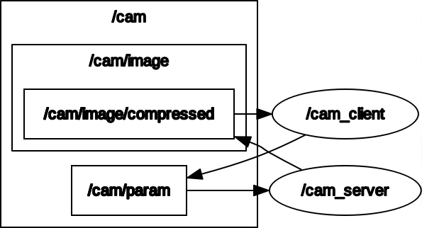

# Simple ROS2 Camera Control Tutorial

## Overview
Control a ROS2 camera node remotely using a Qt application. It's designed for developers looking to integrate ROS2 functionalities with custom Qt GUIs.

## Repository Structure
  -  `/pub-cam`: This directory houses the ROS2 package necessary for enabling video streaming from a camera node.
  -  `/qt-app`: Here you'll find the Qt GUI application. This application provides the functionality to start/stop the video streaming and to display the video feed.

## Computation graph

